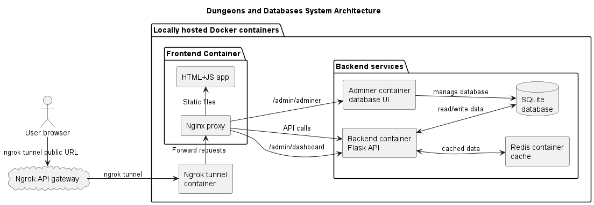

# Dungeons & Databases

> [!IMPORTANT]
> All of the code in this repository has been created using Github Copilot and GPT-5.4 mini agents, available for free to students with a monthly request allowance (generous enough to fit the whole project into). Prompt history available in [prompt_history/copilot_chat_prompts.csv](prompt_history/copilot_chat_prompts.csv).

Browser based dungeon crawler. Equip your character with your best items and delve into the depths of the dungeon. The deeper you go, the better the loot, but beware; The monsters get tougher and only winners get to keep their loot.

## Architecture

### Frontend

Vanilla JavaScript, HTML and CSS.

### Backend

RESTFul hypermedia API implemented in Python with Flask, SQLAlchemy and SQLite. OpenAPI documentation available at `/api/docs`, `/api/openapi.yaml` or the Api Docs button in the frontend login screen.

Backend dependencies can be found in [pyproject.toml](pyproject.toml) and are managed with [uv](https://docs.astral.sh/uv/).

## Deployment using Docker

All Docker deployments require [Docker Compose](https://docs.docker.com/compose/install/). Run the commands from the repository root.

### Running unit tests with code coverage

Run `docker compose --profile test run --rm backend-tests` from the repository root to run the backend API test suite in a temporary container. The generated code coverage report is available at `/htmlcov`.

### Development mode with hot reload

> [!CAUTION]
> The database is wiped every time the containers are restarted.

1. Run `docker compose up --build`
2. Access the frontend app at `http://localhost:8080` and the backend API at `http://localhost:5000`.

### Production mode

Disables hot reload and places the database in a persistent volume.

1. Run `docker compose -f docker-compose.prod.yml up --build`
2. Access the frontend app at `http://localhost:8080`.

## Deployment on Render cloud

Production branch is automatically deployed to a free tier [Render cloud](https://render.com/) instance, with frontend available at <https://dungeons-and-databases.onrender.com>. The deployment configuration can be found in the [docs/deployment.puml](docs/deployment.puml) file.

## Code Coverage

Latest code coverage report of the main branch backend API is available at <https://cyborgwalrus.github.io/dungeons-and-databases/index.html>

## Github Actions

The repository includes the following Github Actions workflows:

* [cicd.yml](.github/workflows/cicd.yml)
  * Runs the backend test suite (stops here if tests fail).
  * Publishes the code coverage report to Github Pages.
  * Pushes main branch changes to the Production branch

## Quick Links

* API docs: `/api/docs`
* OpenAPI spec: `/api/openapi.yaml`
* Frontend app: the root of the deployed site
* Flask admin dashboard: `/admin/dashboard`
* Adminer dashboard for database management: `/admin/adminer`

## Group information

* Hla Kay Poe: [hpoe22@student.oulu.fi](mailto:hpoe22@student.oulu.fi)
* Matias Björklund: [matias.bjorklund@student.oulu.fi](mailto:matias.bjorklund@student.oulu.fi)