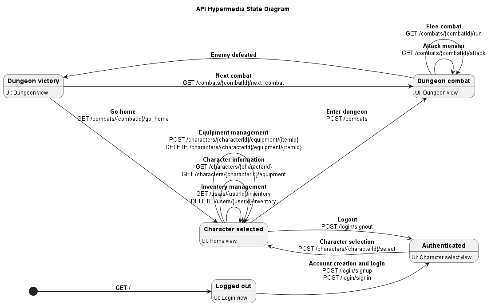

# Backend API Documentation

## Project Structure

The backend is organized as follows:

```text
backend/
├── .dockerignore           # Backend-specific ignore rules for container builds
├── __init__.py             # Marks backend as a Python package
├── app.py                  # Flask application factory, extension setup, and route registration
├── dashboard_config.cfg              # Configuration for Flask monitoring dashboard
├── Dockerfile              # Backend container image definition
├── openapi.yaml            # OpenAPI document served at /api/openapi.yaml and used by Swagger UI
├── README.md               # Backend API notes and endpoint guide
├── start-backend.sh        # Container entrypoint that initializes the database and starts the API
├── adminer/                # Adminer container customizations
│   └── plugins-enabled/    # Enabled Adminer plugins
│       └── login-password-less.php  # Needed for connecting Adminer to SQLite without a password
│
├── db/                     # Database models, enums, session management, and reference data
│   ├── __init__.py         # Database initialization helpers and seed-data exports
│   ├── enemy_types.json    # Reference data for enemy templates
│   ├── enums.py            # Shared enums for model and API state
│   ├── item_types.json     # Reference data for item templates
│   ├── models.py           # SQLModel table definitions and response mappers
│   ├── README.md           # Database layer notes and schema guidance
│   ├── schemas.py          # Pydantic schemas for requests and responses
│   └── session.py          # SQLAlchemy engine and session management
│
├── resources/              # Flask-RESTful resource classes for API endpoints
│   ├── __init__.py         # Resource package exports
│   ├── authentication.py   # Authentication and token endpoints
│   ├── characters.py       # Character management and equipment endpoints
│   ├── combat_builders.py  # Combat setup helpers and dungeon state assembly
│   ├── combat_engine.py    # Turn resolution and combat mechanics
│   ├── combats.py          # Combat lifecycle endpoints
│   ├── items.py            # Item creation and deletion endpoints
│   └── users.py            # User profile and inventory endpoints
│
└── utils/                  # Shared helpers for app setup, caching, hypermedia, and route validation
    ├── __init__.py         # Shared utility exports
    ├── api_response_cache.py # Cache keying and invalidation helpers
    ├── app_init.py         # Bootstrap helpers for Flask, Swagger, dashboard, and converters
    ├── game_utils.py       # Token, reference-data, and game-state helpers
    ├── hypermedia.py       # Hypermedia link construction helpers
    ├── route_helpers.py    # Authorization, item, and response helpers
    └── url_converters.py   # Custom URL parameter converters
```

## Deployment

See the deployment section of the main [README.md](../README.md).

## API Docs

Swagger UI is available at `/api/docs`, and the OpenAPI document is served from `/api/openapi.yaml`.

The API hypermedia state diagram lives at [../docs/hypermedia-state.puml](../docs/hypermedia-state.puml).

## Hypermedia

The API is hypermedia-driven: responses expose `_links` objects that advertise the valid actions for the current resource state.


*Rendered from [docs/hypermedia-state.puml](../docs/hypermedia-state.puml)*


## Endpoint Details

API endpoints use Url converters defined in `utils/url_converters.py` to resolve database objects directly from the URL path. For example, a request to `GET /api/characters/5` will use the `character` converter to fetch the character with ID 5 from the database and pass it as an argument to the route handler.

### Authentication

* `POST /api/login/signup` - create a user account.
* `POST /api/login/signin` - authenticate a user.
* `POST /api/login/signout` - clear the client token.
* `GET /api/login/me` - return the current authenticated user.

Authenticated requests must send `Authorization: Bearer <token>`. The `/login/me` response also includes the currently selected character.

### Users

* `GET /api/users/<user:user>` - fetch one user.
* `PUT /api/users/<user:user>` - update a user.
* `DELETE /api/users/<user:user>` - delete a user.

#### Characters list

* `GET /api/users/<user:user>/characters` - list characters for the specified user.
* `POST /api/users/<user:user>/characters` - create a new character for the specified user.

### Characters

#### Character

* `GET /api/characters/<character:character>` - fetch one character.
* `PUT /api/characters/<character:character>` - update a character's stats.
* `DELETE /api/characters/<character:character>` - delete a character.
* `POST /api/characters/<character:character>/select` - issue a token scoped to the selected character.

#### Equipment Slots

* `GET /api/characters/<character:character>/equipment` - list equipped items for a character.
* `POST /api/characters/<character:character>/equipment/<item:item>` - equip an item into a character equipment slot from the user's shared inventory.
* `DELETE /api/characters/<character:character>/equipment/<item:item>` - unequip an item from a character equipment slot and return it to the user's shared inventory.
* Equipment slot types: `weapon`, `shield`, `armor`, `helmet`, `ring`, and `necklace`. Items have a `slot_type` that determines which slot they can be equipped into.

### Inventory

* `GET /api/users/<user:user>/inventory` - list the shared inventory items for a user.
* `DELETE /api/users/<user:user>/inventory` - clear the shared inventory while preserving equipped items.

### Items

* `POST /api/items` - create one or more new items for the active character.
* `GET /api/items/<item:item>` - fetch one item.
* `DELETE /api/items/<item:item>` - remove an item.

### Combat

* `POST /api/combats` - start a new dungeon combat for the active character.
* `GET /api/combats/<combat:combat>` - fetch the current combat state.
* `GET /api/combats/<combat:combat>/attack` - attack the active combat.
* `GET /api/combats/<combat:combat>/next_combat` - move deeper after defeating the current enemy.
* `GET /api/combats/<combat:combat>/run` - attempt to flee the active combat.
* `GET /api/combats/<combat:combat>/go_home` - leave the dungeon after defeating the current enemy.

## Admin Tools

* `/admin/dashboard` - Flask Monitoring Dashboard.
* `/admin/adminer` - Adminer dashboard for database management.
