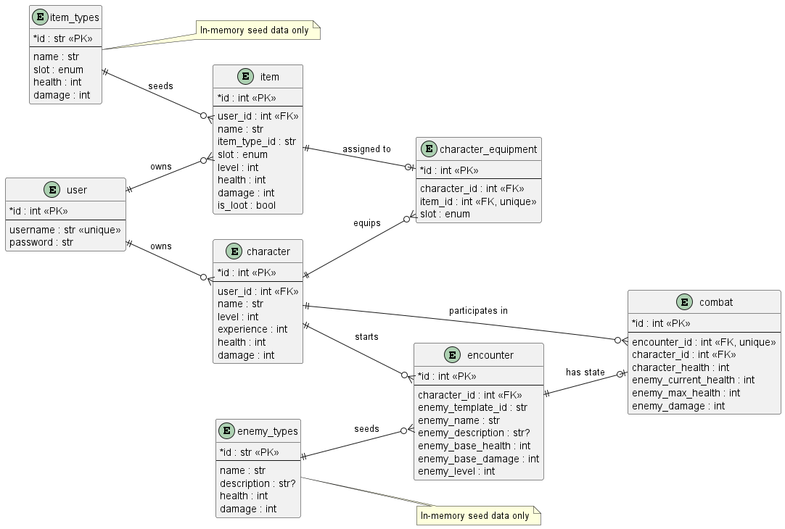

# Database

## Database Design and Implementation

### Database entities


*Rendered from [docs/database-schema.puml](../../docs/database-schema.puml)*

## Database Schema

Template data for items and enemies lives in Python modules under [reference_data](reference_data). The data is kept in memory as module-level seed structures and the database stores the runtime copies on `Item`, `Encounter`, and `Combat`.

### File Organization

- `models.py`: SQLAlchemy ORM model definitions for all entities with table relationships and helper methods
- `reference_data/item_types.py` and `reference_data/enemy_types.py`: in-memory seed data and lookup helpers for item and enemy templates

### Data Reset in development mode

If the Flask app is running in development mode using `FLASK_ENV=development`, the database is automatically wiped and recreated on every application restart. This allows for rapid iteration without manual cleanup. In production mode, the database persists across restarts. To manually reset the database in any environment, use the following Flask CLI commands:

```bash
# Create tables
flask init-db

# Drop all tables and remove the database file
flask delete-db
```

### Schema Details

### User

The User table represents a player account. Each user has a unique username and password used for authentication. Each user can own multiple characters and multiple items.

User | Type | Description | Relations
-- | -- | -- | --
id | int | User ID | PK
username | string | Username | unique
password | string | Hashed password | -

### Character

The Character table represents a playable character. Each character:

- Belongs to a single user
- Has basic attributes: name, level, health, damage, experience
- Levels up when experience reaches the threshold and consumes that experience
- Can have items equipped in specific equipment slots
- Participates in dungeon encounters

Character | Type | Description | Relations
-- | -- | -- | --
id | int | Character ID | PK
user_id | int | Owning User's id | FK User.id
name | string | Character name | -
level | int | Current level (increases with experience) | -
experience | int | Current experience points | -
health | int | Current health | -
damage | int | Base damage before equipment bonuses | -
max_health | property | Max health based on level and equipped bonuses | calculated
bonus_damage | property | Total damage from equipped items | calculated

### Item template data

Item templates are stored in [reference_data/item_types.py](reference_data/item_types.py) as a Python tuple of dictionaries. Each template uses a human-readable slug such as `steel_sword` or `iron_shield`, and the helper functions copy the selected template values into `Item` rows when items are created.

Each item template contains:

- `id`: stable slug used as the lookup key
- `name`: display name
- `slot`: equipment slot string
- `health`: base health bonus
- `damage`: base damage bonus

### Item

Each Item row represents an actual item instance owned by a player. Items are created from JSON templates and include:

- An item level that scales the base health and damage from the template
- An `is_loot` flag indicating whether the item was dropped during the current dungeon run
- A direct `user_id` reference to the owning user

When a character is defeated during a dungeon run, all items with `is_loot=true` are deleted. Successfully looted items are permanently added to the owning user's item collection.

Item | Type | Description | Relations
-- | -- | -- | --
id | int | Item ID | PK
name | string | Item name from the template | -
level | int | Item level (scales damage and health from base) | -
health | int | Effective health | -
damage | int | Effective damage | -
item_type_id | string | Reference template slug | -
user_id | int | Owning user | FK User.id
is_loot | boolean | Marked as loot from current dungeon run | -

### CharacterEquipment

CharacterEquipment links an item to a character's equipment slot. Each character can equip one item per slot (weapon, armor, shield, helmet, ring, necklace). Equipping assigns the item to this table; unequipping removes the row.

CharacterEquipment | Type | Description | Relations
-- | -- | -- | --
id | int | Equipment row ID | PK
character_id | int | Equipped character | FK Character.id
item_id | int | Equipped item | FK Item.id (unique)
slot | enum | Equipment slot | validated against the template data

### Encounter

An Encounter represents an active dungeon combat scenario. When a player enters the dungeon:

1. An Encounter is created and linked to the character
2. An enemy template is randomly selected from the in-memory seed data and its stats are scaled to the current `enemy_level`
3. The encounter stores the template slug, enemy display data, and base stats directly on the row
4. After victory, a new Encounter is created at a higher `enemy_level` based on character progression
5. Defeating an enemy grants experience based on `enemy_level`, not the base template

The `enemy_level` increases with each victory, scaled by the character's level for difficulty progression.

Encounter | Type | Description | Relations
-- | -- | -- | --
id | int | Encounter ID | PK
character_id | int | Player character | FK Character.id
enemy_template_id | string | Enemy template slug | -
enemy_name | string | Enemy name | -
enemy_description | string | Enemy description | -
enemy_base_health | int | Template base health | -
enemy_base_damage | int | Template base damage | -
enemy_level | int | Scaled difficulty level | -

The encounter API returns the static encounter payload. The matching combat API returns the mutable turn-state payload.

### Combat

Combat represents the mutable turn state for an encounter. A combat row is created together with the encounter and stores the character's live health plus the enemy's current health and attack values.

Combat | Type | Description | Relations
-- | -- | -- | --
id | int | Combat ID | PK
encounter_id | int | Parent encounter | FK Encounter.id (unique)
character_id | int | Player character | FK Character.id
character_health | int | Current character health in combat | -
enemy_current_health | int | Current enemy health | -
enemy_max_health | int | Maximum enemy health for the fight | -
enemy_damage | int | Enemy damage for the fight | -

### Item Stacking and Level

Items do not merge or stack, so each Item object is independent. Item level scales damage and health linearly from the base template values. The formula applied during item creation is:

```text
effective_value = base_value + (item_level - 1) * base_value * 0.25
```

### Relationships

Key relationships to understand:

- User ↔ Character: One-to-many. Deleting a user cascades to all characters.
- User ↔ Item: One-to-many. Each user owns all of their item rows.
- Character ↔ CharacterEquipment: One-to-many. Equipment rows link items to character slots.
- Character ↔ Encounter: One-to-many. A character can have zero or one active encounter; old encounters are deleted when new ones are created.
- Character ↔ Combat: One-to-many over time. Combat rows track the live state for a character in an encounter.
- Template seed data ↔ Item: Items copy their template data at creation time.
- Template seed data ↔ Encounter: Encounters copy their selected template data at creation time.

### Cascade Behavior

Deletions cascade automatically:

- Deleting a User deletes all related Characters, Items, CharacterEquipment, and Encounters
- Deleting a Character deletes its CharacterEquipment and Encounters
- Deleting an Encounter deletes its Combat row